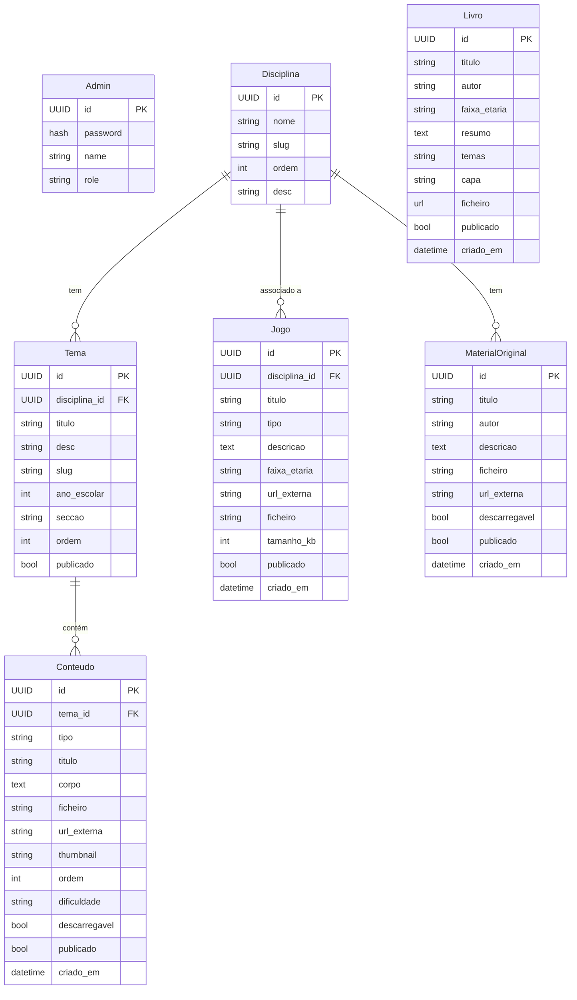
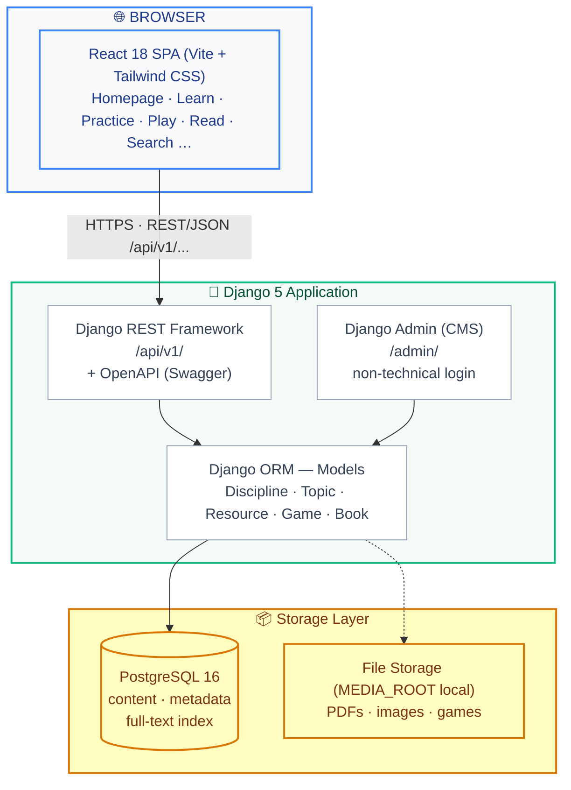

Data Models

```mermaid

erDiagram

    Admin {
        UUID id PK
        hash password
        string name
        string role
    }

    Disciplina {
        UUID id PK
        string nome
        string slug
        int ordem
        string desc
    }

    Tema {
        UUID id PK
        UUID disciplina_id FK
        string titulo
        string desc
        string slug
        int ano_escolar
        string seccao
        int ordem
        bool publicado
    }

    Conteudo {
        UUID id PK
        UUID tema_id FK
        string tipo
        string titulo
        text corpo
        string ficheiro
        string url_externa
        string thumbnail
        int ordem
        string dificuldade
        bool descarregavel
        bool publicado
        datetime criado_em
    }

    Jogo {
        UUID id PK
        UUID disciplina_id FK
        string titulo
        string tipo
        text descricao
        string faixa_etaria
        string url_externa
        string ficheiro
        int tamanho_kb
        bool publicado
        datetime criado_em
    }

    Livro {
        UUID id PK
        string titulo
        string autor
        string faixa_etaria
        text resumo
        string temas
        string capa
        url ficheiro
        bool publicado
        datetime criado_em
    }

    MaterialOriginal {
        UUID id PK
        string titulo
        string autor
        text descricao
        string ficheiro
        string url_externa
        bool descarregavel
        bool publicado
        datetime criado_em
    }

    Disciplina ||--o{ Tema : "tem"
    Tema ||--o{ Conteudo : "contém"
    Disciplina ||--o{ Jogo : "associado a"
    Disciplina ||--o{ MaterialOriginal : "tem"

```

Flow Architecture Graphic

```mermaid

graph TD
    %% Styling Definition
    classDef browser fill:#f9f9fb,stroke:#3b82f6,stroke-width:2px,color:#1e3a8a;
    classDef django fill:#f4fbf7,stroke:#10b981,stroke-width:2px,color:#064e3b;
    classDef db fill:#fefcbf,stroke:#d97706,stroke-width:2px,color:#78350f;
    classDef inner fill:#ffffff,stroke:#94a3b8,stroke-width:1px,color:#334155;

    %% Elements
    subgraph BROWSER ["🌐 BROWSER"]
        SPA["React 18 SPA (Vite + Tailwind CSS)<br>Homepage · Learn · Practice · Play · Read · Search …"]
    end

    subgraph DJANGO ["🐍 Django 5 Application"]
        DRF["Django REST Framework<br>/api/v1/<br>+ OpenAPI (Swagger)"]
        ADMIN["Django Admin (CMS)<br>/admin/<br>non-technical login"]
        ORM["Django ORM — Models<br>Discipline · Topic · Resource · Game · Book"]
    end

    subgraph STORAGE ["📦 Storage Layer"]
        DB[("PostgreSQL 16<br>content · metadata<br>full-text index")]
        FS["File Storage (MEDIA_ROOT local)<br>PDFs · images · games"]
    end

    %% Flows
    SPA -->|HTTPS · REST/JSON /api/v1/...| DRF
    DRF --> ORM
    ADMIN --> ORM
    ORM --> DB
    ORM -.-> FS

    %% Assigning Styles
    class BROWSER,SPA browser;
    class DJANGO django;
    class DRF,ADMIN,ORM inner;
    class STORAGE,DB,FS db;
```

Complete Architecture Flow

```mermaid
flowchart TD

  subgraph BROWSER["Browser"]
    UI["React 18 SPA — Vite + Tailwind CSS"]
    VOICE["Web Speech API — lang='pt-PT'"]
    COOKIE["CookieBanner — localStorage"]
  end

  subgraph DJANGO["Django 5 Application"]

    subgraph API["Django REST Framework — /api/v1/"]
      EP_DISC["GET /disciplinas/\nGET /disciplinas/:slug/"]
      EP_TEMA["GET /temas/\nGET /temas/:slug/"]
      EP_JOGO["GET /jogos/\nGET /jogos/:id/"]
      EP_LIVRO["GET /livros/\nGET /livros/:id/"]
      EP_MAT["GET /materiais/\nGET /materiais/:id/"]
      EP_SEARCH["GET /pesquisa/"]
      EP_ADMIN_DISC["GET · POST /disciplinas/\nPATCH · DELETE /disciplinas/:slug/"]
      EP_ADMIN_TEMA["GET · POST /temas/\nPATCH · DELETE /temas/:slug/"]
      EP_ADMIN_CONT["GET · POST /conteudos/\nPATCH · DELETE /conteudos/:id/"]
      EP_ADMIN_JOGO["GET · POST /jogos/\nPATCH · DELETE /jogos/:id/"]
      EP_ADMIN_LIVRO["GET · POST /livros/\nPATCH · DELETE /livros/:id/"]
      EP_ADMIN_MAT["GET · POST /materiais/\nPATCH · DELETE /materiais/:id/"]
    end

    subgraph ADMIN["Django Admin — /admin/"]
      CMS["CMS Interface — pt-pt"]
    end

    subgraph ORM["Django ORM — Models"]
      M_DISC["Disciplina"]
      M_TEMA["Tema"]
      M_CONT["Conteudo"]
      M_JOGO["Jogo"]
      M_LIVRO["Livro"]
      M_MAT["MaterialOriginal"]
    end

  end

  subgraph STORAGE["Storage"]
    PG["PostgreSQL 16\npg_trgm · unaccent"]
    FILES["MEDIA_ROOT\nPDFs · images · games"]
  end

  subgraph EXTERNAL["External Services"]
    WEB3FORMS["Web3Forms API — api.web3forms.com\nForm-to-email relay · GDPR sub-processor\nBrowser POSTs directly · access_key auth"]
    YOUTUBE["YouTube — youtube-nocookie.com"]
  end

  subgraph DEVOPS["Docker Compose"]
    SVC_DB["db — postgres:16-alpine"]
    SVC_BE["backend — python:3.12 + gunicorn"]
    SVC_FE["frontend — node:20 + nginx"]
  end

  UI --> VOICE
  UI --> COOKIE
  UI -->|"GET only — Django not involved in contact"| API
  UI -->|"iframe embed"| YOUTUBE
  UI -->|"POST /contact · JSON + access_key\nHTTPS · direct browser request"| WEB3FORMS

  EP_DISC --> M_DISC
  EP_TEMA --> M_TEMA
  EP_JOGO --> M_JOGO
  EP_LIVRO --> M_LIVRO
  EP_MAT --> M_MAT
  EP_SEARCH --> M_DISC
  EP_SEARCH --> M_TEMA
  EP_SEARCH --> M_CONT
  EP_SEARCH --> M_JOGO
  EP_SEARCH --> M_LIVRO
  EP_SEARCH --> M_MAT
  EP_ADMIN_DISC --> M_DISC
  EP_ADMIN_TEMA --> M_TEMA
  EP_ADMIN_CONT --> M_CONT
  EP_ADMIN_JOGO --> M_JOGO
  EP_ADMIN_LIVRO --> M_LIVRO
  EP_ADMIN_MAT --> M_MAT

  M_DISC -->|"1 to N"| M_TEMA
  M_TEMA -->|"1 to N"| M_CONT
  M_DISC -->|"1 to N nullable"| M_JOGO
  M_DISC -->|"1 to N"| M_MAT

  ORM --> PG
  ORM --> FILES

  CMS -->|"GET · POST · PATCH · DELETE"| EP_ADMIN_DISC
  CMS -->|"GET · POST · PATCH · DELETE"| EP_ADMIN_TEMA
  CMS -->|"GET · POST · PATCH · DELETE"| EP_ADMIN_CONT
  CMS -->|"GET · POST · PATCH · DELETE"| EP_ADMIN_JOGO
  CMS -->|"GET · POST · PATCH · DELETE"| EP_ADMIN_LIVRO
  CMS -->|"GET · POST · PATCH · DELETE"| EP_ADMIN_MAT

  SVC_DB --> SVC_BE
  SVC_BE --> SVC_FE
```