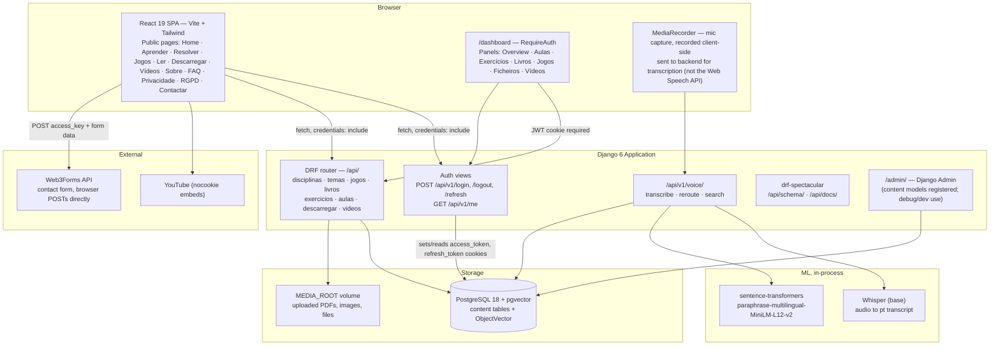
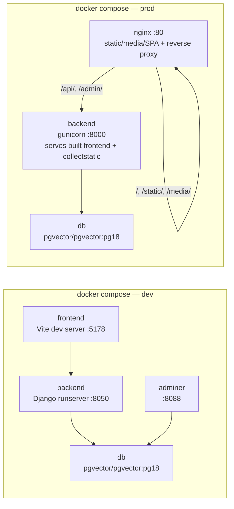

# Architecture — Fase 3

This replaces `ARCHITECTURE.md` as the reference for what the system actually looks like at this point. The original was drawn during Fase 2, before most of this was built, and it's drifted enough from reality (extra fields that don't exist, endpoints that were never built, a CMS surface that's described as "future" when it's actually shipped) that it was doing more harm than good. Everything below was checked against the current models, urls, settings, compose files, and frontend routes rather than carried over from the old diagram.

`ARCHITECTURE.md` stays in the repo for the Fase 2 deliverable link in `DELIVERABLES_FASE_2.md` — don't delete it, just don't trust it for anything current.

## Data model

Pulled out into its own file since it's a separate Fase 3 deliverable — see `DATA_MODEL_FASE3.md` for the ER diagram and the gotchas in how the models actually relate to each other (subject tagging being inconsistent across Jogo/Exercicio/Aula, etc.).

## Two ways content gets in

This is the part the Fase 2 diagram got wrong: it drew Django Admin as *the* CMS. What actually exists today is a custom React dashboard at `/dashboard`, gated by `RequireAuth`, with one panel per content type (Aulas, Exercícios, Livros, Jogos, Ficheiros/Descarregar, Vídeos) — each panel just calls the same DRF endpoints documented in `API_REFERENCE.md`. Django Admin is also wired up now (`integrate/admin.py` registers Disciplina, Tema, Conteudo, Jogo, Livro, Exercicio, Aula), mainly as a developer/debug surface; the dashboard remains the one editors actually use day to day.

`publicado` is enforced server-side: anonymous requests to the catalog only ever get `publicado=True` rows, and only authenticated users (write access requires login too) see drafts. Detail in `WORKFLOW_FASE3.md` section 4.

## Auth, concretely

There isn't one auth system, there are two, and they don't talk to each other:

- **The API** (everything under `/api/`, including what the dashboard calls) uses JWT access/refresh tokens stored as `httponly` cookies — 15-minute access token, 24-hour refresh, rotated on use. Reads are public; writes now require an authenticated session (`IsAuthenticatedOrReadOnly`) on every catalog endpoint. Full detail is in `API_REFERENCE.md`.
- **Django Admin** uses Django's own session cookie, defaulting to a ~2-week lifetime, completely separate from the JWT cookies above. Now that content models are registered there too, it's a second real way to log in and edit — just not the one editors are trained on.

## Deployment topology

Two things worth keeping in sync if either file changes:

- **Prod Postgres matches dev**: both run `pgvector/pgvector:pg18`, which the voice-search migration needs (`CREATE EXTENSION IF NOT EXISTS vector;`). CI's test database uses the same image.
- **`ops/nginx/nginx.conf` proxies `/api/` and `/admin/` to `backend:8000`**, matching what the prod backend container actually exposes (`gunicorn ... --bind 0.0.0.0:8000`).

## What changed since Fase 2

For anyone comparing against the old diagram: Exercício and Aula didn't exist yet, there was no auth system at all (Django Admin was assumed to be the entire CMS), there was no voice search / pgvector / Whisper, no drf-spectacular docs, and no React dashboard. The `/materiais/` and `/pesquisa/` endpoints drawn in the old diagram were never built — the real equivalents are the per-type catalog endpoints (`/api/jogos/`, `/api/livros/`, etc.) and `/api/v1/voice/search/`.
