# Data Model — Fase 3

Entity-relationship diagram for the current schema, checked field-by-field against `srcs/backend/integrate/models.py` and `srcs/backend/voice_search/models.py` — not carried over from the Fase 2 draft in `ARCHITECTURE.md`, which has drifted from what's actually implemented (extra fields like `ordem` that were never built, an `Admin` model that doesn't exist as such, no `Exercicio`/`Aula`/`ObjectVector` at all).

```mermaid
erDiagram

    Disciplina {
        UUID id PK
        string nome
        string slug
        string desc
    }

    Tema {
        UUID id PK
        UUID disciplina_id FK
        string titulo
        string slug
        text desc
        string ano_escolar
        string seccao
    }

    Conteudo {
        UUID id PK
        UUID tema_id FK
        string tipo
        string titulo
        text corpo
        file ficheiro
        url url_externa
        image thumbnail
        string dificuldade
        bool descarregavel
        bool publicado
        datetime criado_em
        UUID created_by_id FK "nullable"
        UUID updated_by_id FK "nullable"
    }

    Jogo {
        UUID id PK
        UUID disciplina_id FK "nullable"
        string titulo
        string descricao
        string faixa_etaria
        string subject_id "free text, not a real FK"
        int level
        string thumbnail_url
        image thumbnail
        url video_url
        url url_externa
        file ficheiro
        bool publicado
        datetime criado_em
        UUID created_by_id FK "nullable"
        UUID updated_by_id FK "nullable"
    }

    Livro {
        UUID id PK
        string titulo
        string autor
        string faixa_etaria
        string resumo
        string temas "free text, not a real relation"
        image capa
        file ficheiro
        bool publicado
        datetime criado_em
        UUID created_by_id FK "nullable"
        UUID updated_by_id FK "nullable"
    }

    Exercicio {
        UUID id PK
        string title
        int level
        string subject_id "free text, not a real FK"
        string title_color
        string icon_img
        string path
        text description
        url pdf_url
        string thumbnail_url
        image thumbnail
        url video_url
        file ficheiro
        bool publicado
        UUID created_by_id FK "nullable"
        UUID updated_by_id FK "nullable"
    }

    Aula {
        UUID id PK
        string title
        string subject_id "free text, not a real FK"
        int level
        text description
        url video_url
        string thumbnail_url
        image thumbnail
        file ficheiro
        datetime created_at
        bool publicado
        UUID created_by_id FK "nullable"
        UUID updated_by_id FK "nullable"
    }

    ObjectVector {
        bigint id PK
        UUID object_id
        string model_type
        string label
        string route
        vector_384 embedding
    }

    Disciplina ||--o{ Tema : "tem"
    Tema ||--o{ Conteudo : "contem"
    Disciplina ||--o{ Jogo : "opcional"
```

## Notes the diagram won't tell you

- **Subject tagging isn't consistent across models.** Jogo has both a real `disciplina` foreign key *and* a free-text `subject_id` field — two different ways of saying the same thing, never reconciled. Exercicio and Aula only have the free-text `subject_id`, with no FK at all. If you're querying by subject, you need to know which shape the model you're touching actually has.
- **Some "relations" are just strings.** `Livro.temas` reads like it should point at `Tema`, but it's a plain CharField — free text in, free text out. Same idea for `Jogo.faixa_etaria` and friends: looks structured, isn't.
- **ObjectVector isn't content** — it's a flat table of precomputed 384-dimension embeddings (`paraphrase-multilingual-MiniLM-L12-v2`) used only for voice-search routing, populated by a management command rather than by anyone editing content directly. It has no FK to the models it represents — `object_id` + `model_type` is a loose, unenforced reference.
- **Conteudo covers four content types through one table** (`tipo`: texto/imagem/video/pdf), and the "required" fields differ by type even though the schema doesn't enforce that — `corpo` is always required, but whether you need `ficheiro` vs `url_externa` depends on `tipo`, and nothing in the database stops you saving an incomplete combination.

For the request/response shape these map to over the API (field renames like `subjectId`, write-only upload fields, etc.), see `API_REFERENCE.md`. For where this fits into the rest of the system, see `ARCHITECTURE_FASE3.md`.
