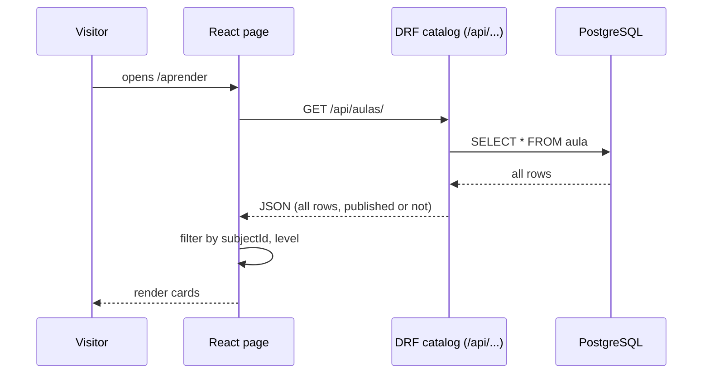
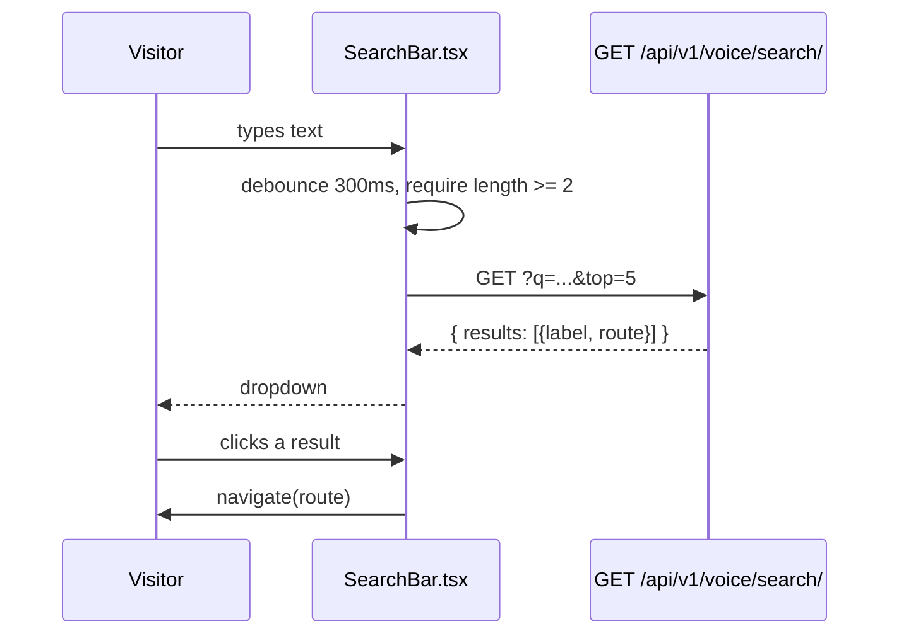
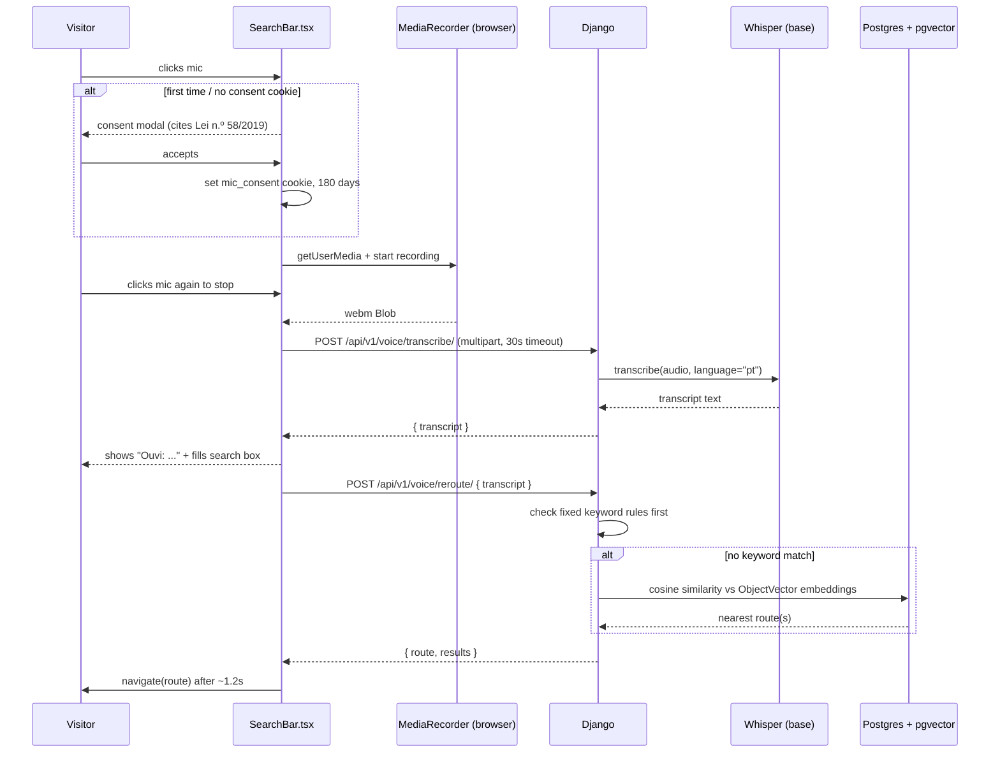
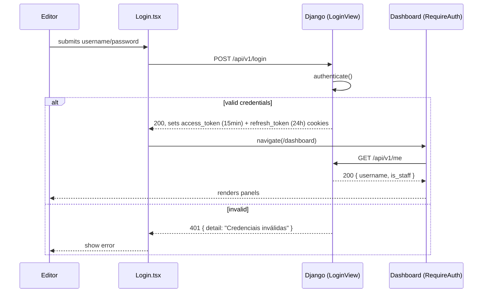
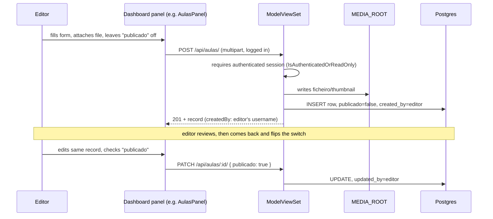
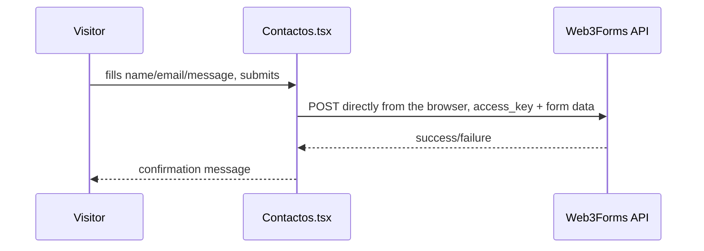

# Application Workflows — Fase 3

Sequence diagrams for the actual request flows through the app, traced through the real components (`SearchBar.tsx`, `services/api/index.ts`, `RequireAuth.tsx`, the dashboard panels) rather than described from how the system is "supposed to" work. Companion to `ARCHITECTURE_FASE3.md` (system layout) and `DATA_MODEL_FASE3.md` (schema).

## 1. Browsing and typed search

Every public page (`Aprender`, `Resolver`, `Jogos`, `Ler`, `Videos`, `Descarregar`) loads its full list from the matching catalog endpoint on mount and filters client-side by subject/level/age — there's no server-side filtering by query params today.

The typed search box (top of every page) hits a different endpoint and isn't really about voice — it's the general-purpose search:

## 2. Voice search

This does **not** use the browser's Web Speech API, despite that being how it's described elsewhere (`CONTRIBUTORS.md`, the old `ARCHITECTURE.md`). What's actually implemented in `SearchBar.tsx`: the mic button records raw audio with `MediaRecorder`, ships the blob to the backend, and Whisper does the transcription server-side.

The audio itself is never persisted — it's written to a temp file for Whisper, transcribed, then deleted (`voice_search/views.py`, `transcribe`). The consent modal exists because recording audio without consent would be a problem; nothing about the transcript or the audio file is stored afterward.

## 3. Login and session refresh

Two separate auth systems exist side by side — this flow is for the JWT/cookie one that the dashboard and login page actually use, not Django Admin's session auth.

Login is rate-limited to 5 attempts/hour per IP (`LoginThrottle`).

Once inside the dashboard, every API call goes through `fetchWithConfig` (`services/api/index.ts`), which transparently retries once on a 401 by refreshing the access token first:

```mermaid
sequenceDiagram
    participant P as Dashboard panel
    participant F as fetchWithConfig
    participant API as DRF endpoint

    P->>F: e.g. descarregarApi.getDescarregaveis()
    F->>API: GET /api/descarregar/ (credentials: include)
    alt access token still valid
        API-->>F: 200 + data
    else access token expired
        API-->>F: 401
        F->>API: POST /api/v1/refresh (refresh_token cookie)
        alt refresh succeeds
            API-->>F: 200, new access_token cookie
            F->>API: retries original GET (marked _isRetry)
            API-->>F: 200 + data
        else refresh also fails
            F-->>P: throws "Sessão expirada"
        end
    end
    F-->>P: data or error
```

Concurrent requests during a refresh share one in-flight refresh call (`activeRefreshPromise`) instead of each firing their own — otherwise a page that fires five requests at once on an expired token would trigger five refresh attempts.

## 4. Creating and publishing content

`publicado` is the single gate controlling what's publicly visible (see `CMS_USER_GUIDE.md` section 3), enforced at the API level: every catalog `ModelViewSet` filters `publicado=True` for anonymous requests at the queryset level (`PublishedForAnonymousMixin` in `integrate/views.py`), and write access requires a logged-in session (`IsAuthenticatedOrReadOnly`). A logged-in user sees everything, drafts included, so the dashboard can show editors their own unpublished work.

| Public page | Sees unpublished drafts? |
|---|---|
| Vídeos | no |
| Descarregar | no |
| Aprender (Aulas) | no |
| Resolver (Exercícios) | no |
| Jogos | no |
| Ler (Livros) | no |

The filter applies regardless of how the catalog is queried — anonymous `GET /api/jogos/` returns only published rows, anonymous `POST` returns `401`, and an authenticated request sees both published and draft rows and can create/update normally.

## 5. Contact form

The one flow that doesn't touch Django at all:

No backend involvement, no record of the submission in this app's database — Web3Forms relays it straight to email. Worth knowing if anyone ever asks "where are the contact form submissions stored" — they aren't, anywhere in this codebase.
